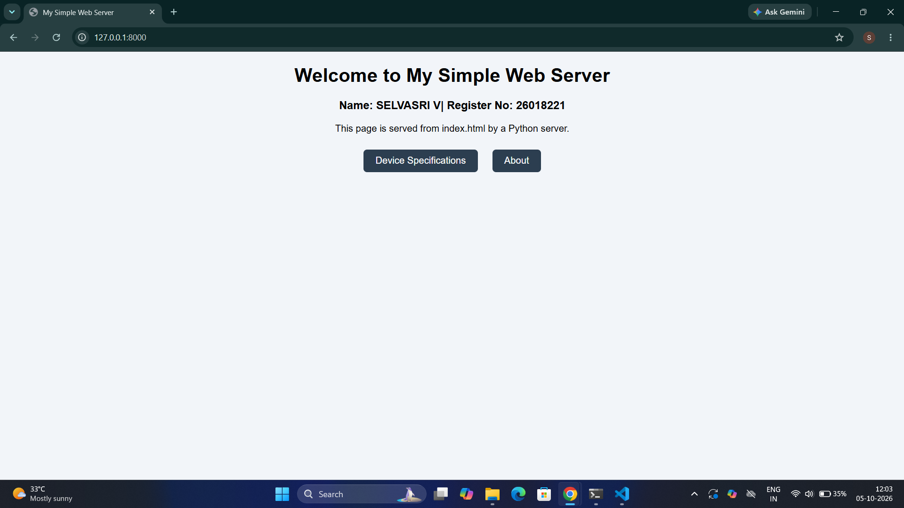
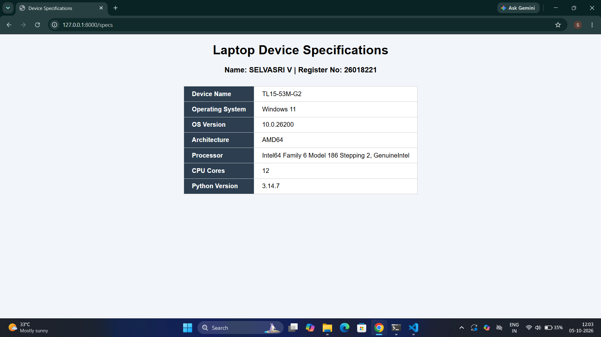
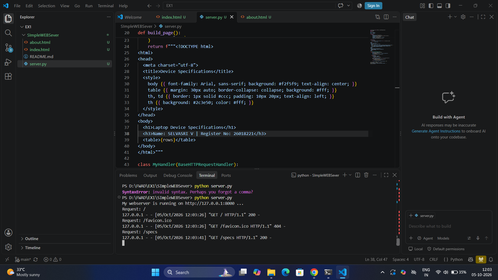

# SImpleWEBSever
# EX01 Developing a Simple Webserver
## Date:05/10/2026
## AIM:
To develop a simple webserver to serve html pages and display the Device Specifications of your Laptop.

## DESIGN STEPS:
### Step 1: 
HTML content creation.

### Step 2:
Design of webserver workflow.

### Step 3:
Implementation using Python code.

### Step 4:
Import the necessary modules.

### Step 5:
Define a custom request handler.

### Step 6:
Start an HTTP server on a specific port.

### Step 7:
Run the Python script to serve web pages.

### Step 8:
Serve the HTML pages.

### Step 9:
Start the server script and check for errors.

### Step 10:
Open a browser and navigate to http://127.0.0.1:8000 (or the assigned port).

## PROGRAM:
```
from http.server import HTTPServer, BaseHTTPRequestHandler
import platform
import socket
import os

NAME = "SELVASRI V"
REG_NO = "26018221"

def get_specs():
    return {
        "Device Name": socket.gethostname(),
        "Operating System": f"{platform.system()} {platform.release()}",
        "OS Version": platform.version(),
        "Architecture": platform.machine(),
        "Processor": platform.processor() or "Unknown",
        "CPU Cores": os.cpu_count(),
        "Python Version": platform.python_version(),
    }

def build_page():
    rows = "".join(
        f"<tr><th>{k}</th><td>{v}</td></tr>" for k, v in get_specs().items()
    )
    return f"""<!DOCTYPE html>
<html>
<head>
  <meta charset="utf-8">
  <title>Device Specifications</title>
  <style>
    body {{ font-family: Arial, sans-serif; background: #f2f5f9; text-align: center; }}
    table {{ margin: 30px auto; border-collapse: collapse; background: #fff; }}
    th, td {{ border: 1px solid #ccc; padding: 10px 20px; text-align: left; }}
    th {{ background: #2c3e50; color: #fff; }}
  </style>
</head>
<body>
  <h1>Laptop Device Specifications</h1>
  <h3>Name: SELVASRI V | Register No: 26018221</h3>
  <table>{rows}</table>
</body>
</html>"""

class MyHandler(BaseHTTPRequestHandler):
    def send_html(self, content, status=200):
        self.send_response(status)
        self.send_header("Content-Type", "text/html; charset=utf-8")
        self.end_headers()
        self.wfile.write(content.encode("utf-8"))

    def do_GET(self):
        print("Request:", self.path)
        if self.path == "/specs":
            self.send_html(build_page())
            return
        name = "index.html" if self.path == "/" else self.path.lstrip("/")
        name = os.path.basename(name)
        if name.endswith(".html") and os.path.exists(name):
            with open(name, encoding="utf-8") as f:
                self.send_html(f.read())
        else:
            self.send_html("<h1>404 - Page Not Found</h1>", 404)

server_address = ("", 8000)
httpd = HTTPServer(server_address, MyHandler)
print("My webserver is running on http://127.0.0.1:8000 ...")
httpd.serve_forever()
```

# OUTPUT:



## RESULT:
The program for implementing simple webserver is executed successfully.
